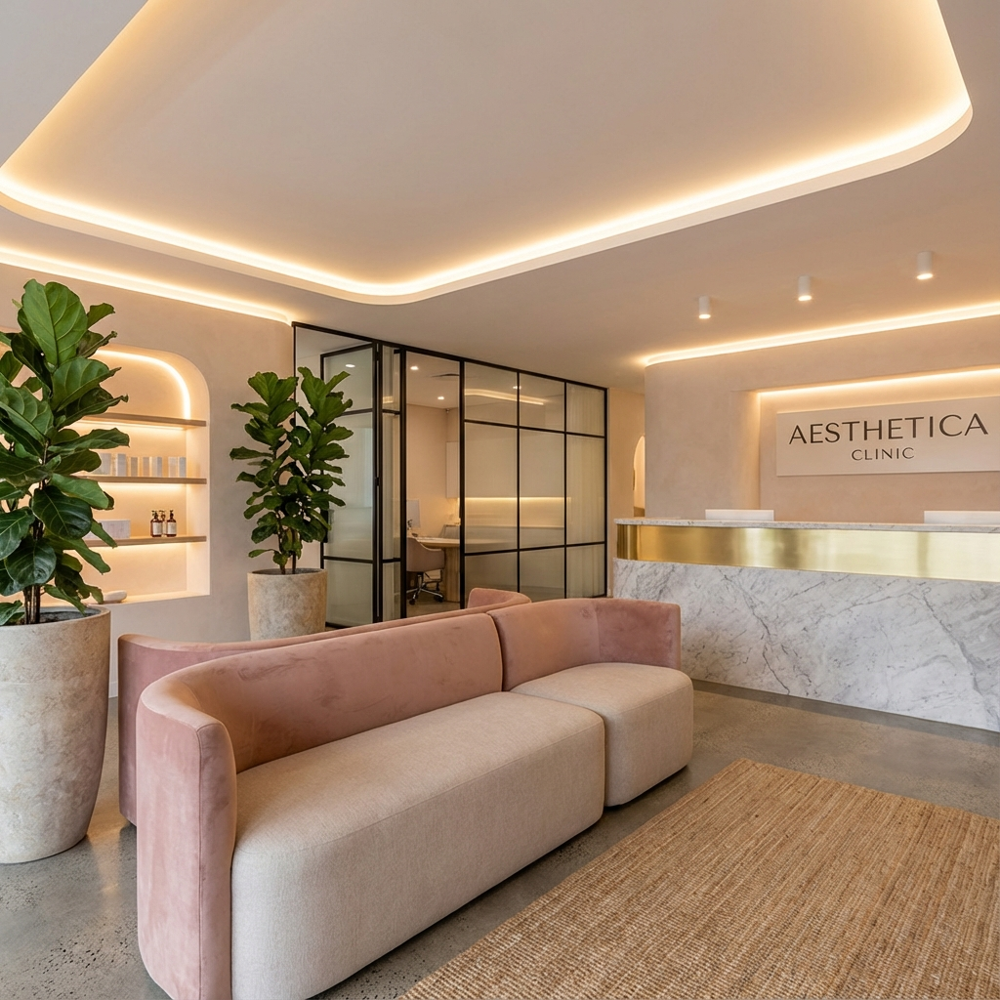

# 📚 DOCUMENTACIÓN DEL CÓDIGO - BELLE AESTHETIC

Esta documentación explica en detalle cada sección del código para que sea fácil de entender y modificar.

---

## 📁 ESTRUCTURA DE ARCHIVOS

```
Belle Stetic/
├── index.html              # Página principal
├── turismo-estetico.html   # Página de turismo estético
├── nosotros.html           # Página sobre nosotros
├── contacto.html           # Página de contacto
├── css/
│   └── style.css          # Todos los estilos del sitio
├── js/
│   └── main.js            # Toda la funcionalidad JavaScript
└── img/
    ├── clinic_reception.png   # Imagen de recepción
    ├── clinic_treatment.png   # Imagen de sala de tratamiento
    ├── clinic_waiting.png     # Imagen de área de espera
    └── clinic_equipment.png   # Imagen de equipos médicos
```

---

## 🎨 PALETA DE COLORES

La paleta de colores está definida en `style.css` (líneas 6-28) usando variables CSS:

```css
:root {
    --primary-color: #D4A5A5;      /* Rosa suave elegante - Color principal */
    --primary-dark: #B88B8B;       /* Rosa oscuro - Para hover y acentos */
    --text-color: #4A3428;         /* Marrón oscuro - Texto principal */
    --light-text: #8B7355;         /* Marrón claro - Texto secundario */
    --bg-light: #FFF9F0;           /* Crema claro - Fondos de secciones */
    --white: #FFFFFF;              /* Blanco puro */
    --black: #2D1F1A;              /* Marrón muy oscuro - Fondos oscuros */
}
```

### ¿Cómo cambiar los colores?
1. Abre `css/style.css`
2. Busca la sección `:root` (línea 6)
3. Cambia los valores hexadecimales (#D4A5A5, etc.)
4. Los cambios se aplicarán automáticamente en todo el sitio

---

## 🏠 PÁGINA PRINCIPAL (index.html)

### Orden de las secciones:
1. **Header** (Navegación)
2. **Hero** (Sección principal con título)
3. **Galería de la Clínica** (Carrusel de instalaciones) ⭐ NUEVO
4. **Testimonios** (Opiniones de clientes)
5. **Experiencia Premium** (Grid de características)
6. **CTA** (Llamado a la acción)
7. **Footer** (Pie de página)

---

## 🖼️ CARRUSEL DE LA CLÍNICA

### Ubicación en el código:
- **HTML**: `index.html` líneas 49-95
- **CSS**: `style.css` líneas 1272-1435
- **JavaScript**: `main.js` líneas 268-354

### ¿Cómo funciona?

#### 1. Estructura HTML
```html
<div class="clinic-carousel-container">
    <!-- Track que contiene todos los slides -->
    <div class="clinic-carousel-track">
        <!-- Cada slide es una imagen con caption -->
        <div class="clinic-slide active">
            
            <div class="slide-caption">
                <h3>Recepción</h3>
                <p>Ambiente acogedor</p>
            </div>
        </div>
        <!-- Más slides... -->
    </div>
    
    <!-- Botones de navegación -->
    <div class="clinic-carousel-controls">
        <button class="clinic-prev-btn">←</button>
        <button class="clinic-next-btn">→</button>
    </div>
    
    <!-- Puntos indicadores (se crean con JavaScript) -->
    <div class="clinic-carousel-dots"></div>
</div>
```

#### 2. Estilos CSS

**Contenedor principal:**
```css
.clinic-carousel-container {
    position: relative;          /* Para posicionar elementos internos */
    max-width: 1000px;          /* Ancho máximo */
    margin: 0 auto;             /* Centrado */
    overflow: hidden;           /* Oculta slides que no están activos */
    border-radius: 20px;        /* Bordes redondeados */
    box-shadow: var(--shadow);  /* Sombra elegante */
}
```

**Slides:**
```css
.clinic-slide {
    min-width: 100%;           /* Cada slide ocupa todo el ancho */
    opacity: 0;                /* Oculto por defecto */
    display: none;             /* No se muestra */
}

.clinic-slide.active {
    opacity: 1;                /* Visible cuando está activo */
    display: block;            /* Se muestra */
    animation: fadeInSlide 0.6s ease;  /* Animación suave */
}
```

**Captions (títulos sobre las imágenes):**
```css
.slide-caption {
    position: absolute;                    /* Posicionado sobre la imagen */
    bottom: 0;                            /* En la parte inferior */
    background: linear-gradient(...);     /* Gradiente oscuro */
    padding: 40px 30px 30px;             /* Espaciado interno */
    color: var(--white);                 /* Texto blanco */
}
```

**Botones de navegación:**
```css
.clinic-carousel-controls button {
    background: rgba(255, 255, 255, 0.9);  /* Fondo blanco semi-transparente */
    border: 2px solid var(--primary-color); /* Borde rosa */
    width: 55px;                            /* Tamaño circular */
    height: 55px;
    border-radius: 50%;                     /* Forma circular */
}

.clinic-carousel-controls button:hover {
    background: var(--primary-color);       /* Fondo rosa al pasar el mouse */
    color: var(--white);                    /* Texto blanco */
    transform: scale(1.1);                  /* Crece un poco */
}
```

#### 3. Funcionalidad JavaScript

**Inicialización:**
```javascript
// Seleccionar todos los elementos necesarios
const clinicSlides = document.querySelectorAll('.clinic-slide');
const clinicPrevBtn = document.querySelector('.clinic-prev-btn');
const clinicNextBtn = document.querySelector('.clinic-next-btn');
let currentClinicSlide = 0;  // Índice del slide actual
```

**Crear puntos indicadores:**
```javascript
// Por cada slide, crear un punto
clinicSlides.forEach((_, index) => {
    const dot = document.createElement('div');
    dot.classList.add('dot');
    if (index === 0) dot.classList.add('active');  // Primer punto activo
    dot.addEventListener('click', () => goToClinicSlide(index));
    clinicDotsContainer.appendChild(dot);
});
```

**Mostrar un slide específico:**
```javascript
function showClinicSlide(index) {
    // Ocultar todos los slides
    clinicSlides.forEach(slide => slide.classList.remove('active'));
    clinicDots.forEach(dot => dot.classList.remove('active'));
    
    // Mostrar solo el slide actual
    clinicSlides[index].classList.add('active');
    clinicDots[index].classList.add('active');
}
```

**Navegación:**
```javascript
// Ir al siguiente slide
function nextClinicSlide() {
    currentClinicSlide++;
    if (currentClinicSlide >= clinicSlides.length) {
        currentClinicSlide = 0;  // Volver al primero
    }
    showClinicSlide(currentClinicSlide);
}

// Ir al slide anterior
function prevClinicSlide() {
    currentClinicSlide--;
    if (currentClinicSlide < 0) {
        currentClinicSlide = clinicSlides.length - 1;  // Ir al último
    }
    showClinicSlide(currentClinicSlide);
}
```

**Auto-play:**
```javascript
// Cambiar de slide automáticamente cada 5 segundos
clinicAutoplayInterval = setInterval(nextClinicSlide, 5000);

// Pausar al pasar el mouse
clinicCarousel.addEventListener('mouseenter', () => {
    clearInterval(clinicAutoplayInterval);  // Detener auto-play
});

// Reanudar al quitar el mouse
clinicCarousel.addEventListener('mouseleave', () => {
    clinicAutoplayInterval = setInterval(nextClinicSlide, 5000);
});
```

### ¿Cómo agregar más slides?

1. **Agregar la imagen** a la carpeta `img/`

2. **Agregar el HTML** en `index.html`:
```html
<div class="clinic-slide">
    
    <div class="slide-caption">
        <h3>Título</h3>
        <p>Descripción breve</p>
    </div>
</div>
```

3. **No necesitas modificar CSS ni JavaScript** - se adapta automáticamente

### ¿Cómo cambiar la velocidad del auto-play?

En `main.js` línea ~335, cambia el número (en milisegundos):
```javascript
// 5000 = 5 segundos
// 3000 = 3 segundos
// 10000 = 10 segundos
clinicAutoplayInterval = setInterval(nextClinicSlide, 5000);
```

---

## 💬 CARRUSEL DE TESTIMONIOS

### Ubicación en el código:
- **HTML**: `index.html` líneas 146-201
- **CSS**: `style.css` líneas 854-972
- **JavaScript**: `main.js` líneas 167-203

### ¿Cómo funciona?

Similar al carrusel de la clínica, pero más simple:
- Solo muestra un testimonio a la vez
- Incluye foto del cliente, nombre y tipo de tratamiento
- Auto-play cada 5 segundos
- Botones anterior/siguiente

### ¿Cómo agregar un nuevo testimonio?

En `index.html`, agrega dentro de `<div class="carousel-track">`:
```html
<div class="testimonial-card">
    <div class="quote-icon"><i class="fas fa-quote-left"></i></div>
    <p>"Tu testimonio aquí..."</p>
    <div class="client-info">
        
        <div>
            <h4>Nombre del Cliente</h4>
            <span>Tipo de Tratamiento</span>
        </div>
    </div>
</div>
```

---

## 🔄 SLIDER ANTES/DESPUÉS

### Ubicación:
- **Página**: `turismo-estetico.html` (movido desde index.html)
- **CSS**: `style.css` líneas 1104-1207
- **JavaScript**: `main.js` líneas 205-249

### ¿Cómo funciona?

1. Dos imágenes superpuestas (antes y después)
2. Un control deslizante que revela la imagen "después"
3. Funciona con mouse y touch (móviles)

### ¿Cómo cambiar las imágenes?

En `turismo-estetico.html`, busca la sección "ANTES Y DESPUÉS" y cambia las URLs:
```html
<!-- Imagen ANTES -->


<!-- Imagen DESPUÉS -->

```

**IMPORTANTE**: Ambas imágenes deben ser del mismo tamaño para que funcione correctamente.

---

## 📱 DISEÑO RESPONSIVE

El sitio se adapta automáticamente a diferentes tamaños de pantalla:

### Breakpoints (puntos de quiebre):
- **Desktop**: > 768px (pantallas grandes)
- **Tablet/Mobile**: ≤ 768px (pantallas pequeñas)

### Cambios en móvil:
```css
@media (max-width: 768px) {
    /* Carrusel de clínica: altura reducida */
    .clinic-slide img {
        height: 400px;  /* En desktop es 600px */
    }
    
    /* Botones más pequeños */
    .clinic-carousel-controls button {
        width: 45px;    /* En desktop es 55px */
        height: 45px;
    }
    
    /* Menú hamburguesa visible */
    .mobile-menu-btn {
        display: block;
    }
}
```

---

---

## ⚡ GUÍA DE MODIFICACIÓN RÁPIDA (PARA TI)

He diseñado esta sección para que puedas hacer cambios comunes sin tener que buscar en miles de líneas de código.

### 📌 1. ¿Cómo cambio los colores de la página?
Toda la paleta de colores vive en `css/style.css`.
*   **Pasos:** Abre el archivo, busca `:root` al principio y cambia los códigos hexadecimales (Ej: `#D4A5A5`).
*   **Tip:** He dejado comentarios al lado de cada color indicando dónde se usa (ej: botones, textos, fondos).

### 📌 2. ¿Cómo cambio el logo?
1.  Pon tu nuevo logo en la carpeta `img/`.
2.  Asegúrate de que se llame `Logo-letra-transparente.png` (reemplazando el anterior).
3.  Si quieres usar otro nombre, deberás buscar la etiqueta `` en el header de cada archivo HTML.

### 📌 3. ¿Cómo actualizo la información de contacto (Teléfono/Dirección)?
Debes hacerlo en tres lugares para que Google y los usuarios lo vean bien:
1.  **En el Footer:** Al final de cada archivo HTML (`index.html`, etc.).
2.  **En el Schema SEO:** Dentro de la etiqueta `<script type="application/ld+json">` en el `<head>` de cada archivo. Busca `"telephone"` y `"streetAddress"`.
3.  **En la página de Contacto:** En `servicios.html` (al final, en la sección de ubicación).

### 📌 4. ¿Cómo agrego o cambio un tratamiento?
Los tratamientos están en `servicios.html`.
*   Busca la sección `<!-- 3. CATÁLOGO DE SERVICIOS -->`.
*   Cada tratamiento es un bloque con la clase `service-card`.
*   Puedes copiar uno existente y cambiarle el nombre, el icono (de FontAwesome) y el texto.

### 📌 5. ¿Cómo cambio las fotos de "Instalaciones"?
Las fotos del carrusel están en `index.html`.
*   Busca `<!-- 3. GALERÍA DE INSTALACIONES (Carrusel) -->`.
*   Cada imagen tiene una etiqueta ``. Cambia la ruta `src="img/foto.jpg"` por la de tu nueva foto.

### 📌 6. ¿Cómo cambio las fotos de "Antes y Después"?
*   Ve a `index.html` (o `turismo-estetico.html`).
*   Busca `<!-- 4. RESULTADOS REALES -->`.
*   Cambia las fuentes de imagen (`src`) dentro de `img-background` (Después) y `img-foreground` (Antes).

---

## 🛠️ ESTRUCTURA TÉCNICA RECOMENDADA

Para mantener el orden, siempre sigues esta jerarquía:
1.  **HTML:** Estructura (el "esqueleto").
2.  **CSS:** Diseño (el "maquillaje").
3.  **JS:** Funcionalidad (el "movimiento").

Si agregas una nueva sección, asegúrate de ponerle un comentario para saber qué es en el futuro.

---

**Última actualización**: 19 de Diciembre, 2025
**Estado del Código**: Optimizado para SEO - Comentado - 100% Funcional

---

## 📝 REGISTRO DE CAMBIOS RECIENTES (Enero 2026)

A continuación se detallan las actualizaciones críticas realizadas para preparar el sitio para su lanzamiento y asegurar su rendimiento.

### 1. Migración de Dominio Completa
*   **Cambio**: Se reemplazó todo rastro de `belleaesthetic.com` por `bellemedicalcenter.com` en HTML, sitemaps, robots.txt y metadatos.
*   **¿Por qué?**: Para asegurar que Google indexe el sitio bajo el dominio oficial, evitar errores de "contenido duplicado" y garantizar que todos los enlaces compartidos en redes sociales funcionen correctamente.

### 2. Actualización de Horarios de Atención
*   **Cambio**: Se ajustaron los horarios a **Lunes-Sábado 10:00 AM - 5:30 PM (Domingos cerrado)** en todas las páginas y esquemas de datos estructurados.
*   **¿Por qué?**: La consistencia (NAP Consistency) es clave para el SEO Local. Si Google, Facebook y tu web muestran horarios diferentes, afecta negativamente tu ranking en Google Maps.

### 3. Creación de `llms.txt` para Inteligencia Artificial (AEO)
*   **Cambio**: Se añadió un archivo `llms.txt` en la raíz del sitio con información resumida de la clínica.
*   **¿Por qué?**: Esto es parte de la **Optimización para Motores de IA (AEO)**. Este archivo "educa" a IAs como ChatGPT, Perplexity y Claude sobre quién es Belle Aesthetic, ayudando a que te recomienden con datos precisos cuando los usuarios pregunten.

### 4. Auditoría y Corrección Técnica SEO
*   **Cambio**: Revisión exhaustiva de etiquetas `alt` en imágenes y eliminación de enlaces de prueba.
*   **¿Por qué?**: Las imágenes sin texto alternativo son invisibles para Google. Ahora, tus imágenes ayudan al posicionamiento. Además, eliminar enlaces rotos mejora la experiencia del usuario y la "salud" del sitio ante Google.

### 5. Consistencia de Marca y Datos
*   **Cambio**: Unificación de nombres ("BELLE AESTHETIC") y normalización de direcciones y teléfonos en el código fuente.
*   **¿Por qué?**: Pequeñas discrepancias (como un espacio extra en la dirección) pueden hacer que Google dude de la veracidad del negocio. La uniformidad total maximiza la confianza del algoritmo.


